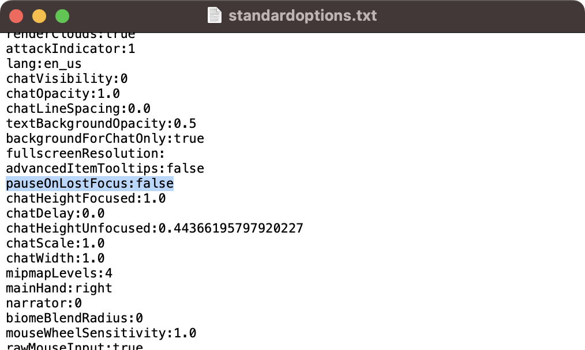
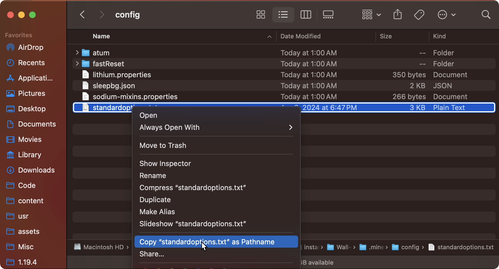
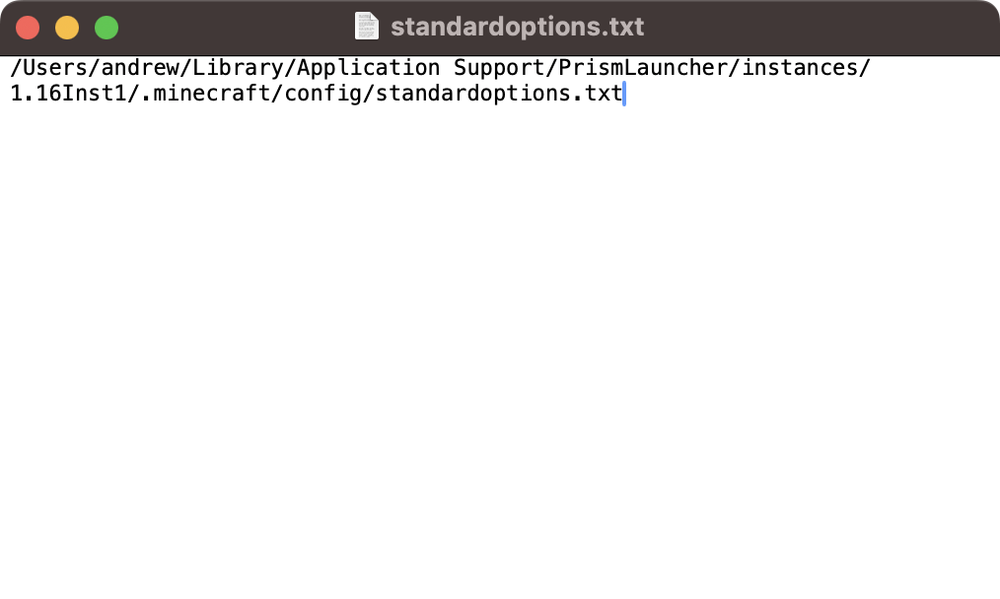
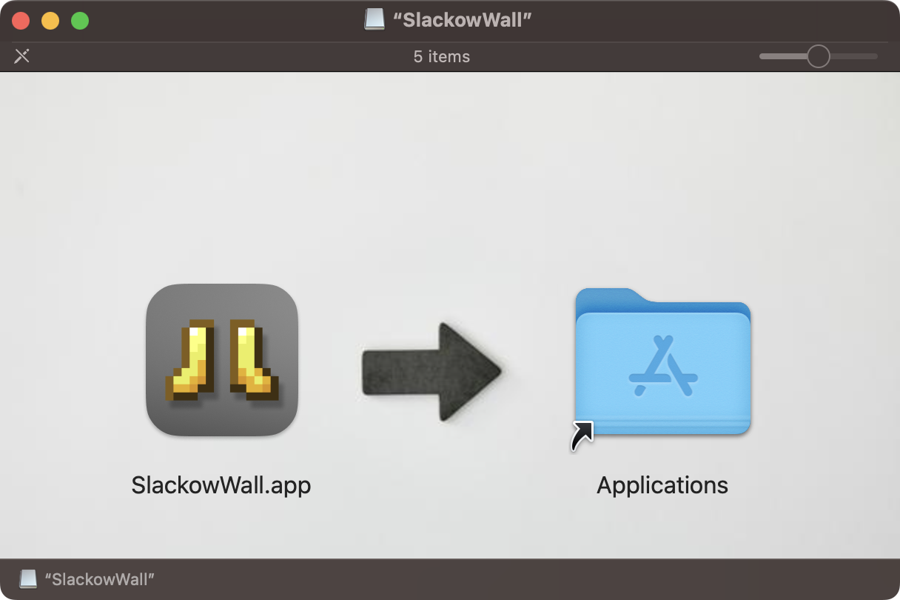
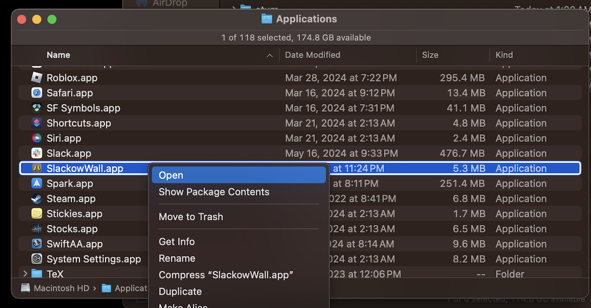
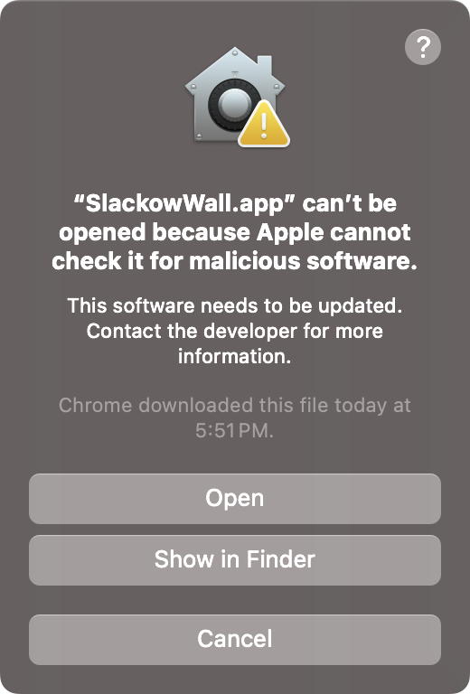

# SlackowWall Setup Guide

If you require additional assistance check out the maccord discord [here](https://discord.gg/zxGDAEWf3h).

TL-DR at the end for more experienced users.

## Required Software
- SlackowWall requires you use [PrismLauncher](https://prismlauncher.org) (highly recommended) or [MultiMC](https://multimc.org) for it to detect your instances.
- Also make sure your [OBS](https://obsproject.com/) version is 30.1.2 or higher, and the arm version if you are on an M series mac.

## Setting up Instances
Before getting started with Installing SlackowWall, you should make your instances in PrismLauncher.

### Setup Instance 1

The name of your first instance should end with a **1**, instance numbers are determined by the name of the instance this way. (Ex: `1.16Inst1`) it's also recommended to put your wall into a new group.

Your first instance can be a clone of an existing one, or one you get from following [this guide](https://www.youtube.com/watch?v=GomIeW5xdBM). but make sure your instance also fulfills the following requirements. (This is also a great time to update your mods by checking [here](https://mods.tildejustin.dev/))

Required Mods:
- StandardSettings version 1.2.3 or higher
- Atum

Recommended Mods:
- Sodium Mac (fixes a memory leak)
- SleepBG (Lowers framerates of unfocussed instances)
- State Output Mod (Prevents you from reseting instances that are on a dirt screen, make sure to enable this setting too if you get it)

#### Configurations
For standard settings, ensure that you have `pauseOnLostFocus:false` and `f3PauseOnWorldJoin:true` in your instance. (You may have to start your instance if you just added the latest StandardSettings).

If F3 pausing doesn't exist in your version (<1.13) then leave `pauseOnLostFocus` on.

Also leave your Atum keybind to the default of `F6`.

### Setup Instance 2
Copy your first instance, this time end the instance name with a **2** instead. Also untick the `Copy Saves` option, but leave everything else ticked. (ex: `1.16Inst2`)

Now the only thing you have to change is the `standardoptions.txt` file. Copy the path of the **first** instance's `standardoptions.txt` file by holding option after right clicking it:

Now replace the contents of the **second** instance's `standardoptions.txt` file with this path.

This will make the second instance reference the settings from the first, so you only have to adjust the first instance's settings in the future.

### Setup Remaining Instances
Now you can create your remaining instances, typically a total of 4, 6, or 9 depending on your hardware, but you can add more if desired.

Similarlly to creating the second instance, clone the second instance and change the number at the end to be the next instance number (ex: `1.16Inst3`, `1.16Inst4`, `1.16Inst5`)

Just like before, if you mess up a name when creating an instance, do not rename it. Instead, delete the instance and clone it again because the folder does not get renamed when you rename instances.

You've now created all your instances!

## Getting SlackowWall
- Download `SlackowWall.dmg` from [here](https://github.com/Slackow/SlackowWall/releases/latest/), SlackowWall auto-updates, so no need to get it again after this.
- Open it and drag the app into your Applications folder.

- Now you'll have to navigate to your Applications folder, which you can do directly from the dmg, or otherwise.
- Right click the app and press "Open".

- You should see a menu like this:

- Press “Open.” (If you don’t have that option, try it a second time.)

## Setup SlackowWall

The app should now open and prompt you to give it accessibility permissions, this is because SlackowWall uses these permissions to listen to keybinds and manage the instance windows. You'll need to grant these permissions.

After granting accessibility permissions, press the refresh icon in the top right corner. The app will now ask you to grant screen recording permissions, this is because SlackowWall relays your instances to it's main screen, it requires these, so grant them as well.

You'll need to restart the app now.

If you see "No Minecraft Instances Detected" open the first instance and then press the refresh icon once more.

**Finally, before any instance will respond to keybinds, you must first focus on each minecraft window and simply click on it at least once after they've launched.**

After this, SlackowWall should functionally work for you with the standard wall keybinds, you can go into the settings menu with `CMD + ,` and read through some of the options, and adjust them how you like, most settings contain a description or are relatively straightforward.

## OBS Setup

In order to get OBS to target the instance you are currently in, additional setup is required.
For OBS, you need to create just two scenes: one that displays the Wall and one that displays the current instance. There is also a video below that shows all these instructions being followed.

### Scenes/Sources

In the wall scene add a macOS Screen Capture that targets SlackowWall's window. **You'll have to reselect the window everytime you restart SlackowWall**.

In the other scene, add a macOS Screen Capture to target your current Minecraft instance. You should call this “minecraft”, (case sensitive), and make this instance target one of your instances. You’ll also have to reselect this every time you start running, but it can start as any instance.

Be sure to not use any deprecated captures in any scene! They can ruin performance.

### OBS Script

Finally, you need to add and configure the associated OBS Script. If you've opened the app at least once it should be located under `~/Library/Application Support/SlackowWall/instance_selector.lua`. There is also a button to open the folder containing the script in SlackowWall's settings.

In OBS's menubar, go under `Tools > Scripts` and press the plus icon in the menu, you can either navigate to the script directly in this window, or drag the script from another finder window to open it (shown in the video).

In the script menu, there should be a text field. If this is empty it will be interpreted as "minecraft". This textfield is the name of the *source* that the script will modify to display your game.

### Script keybinds

You also need to synchronize some keybinds from SlackowWall to OBS in order for the script to work. In particular you should set the `Run Instance Hotkey` in OBS to have the same values as your `Run Hovered` and `Run Hovered and Reset Others` hotkeys (default `R` and `F`).

Your Global Reset key, (default `U`), should also be bound to switch to your wall scene.

If you change your "resetting mode" option you'll likely have to adjust this

### OBS Setup Video
Here's a short [video](https://youtu.be/kjjeruApArc) showing the entire OBS setup process.

You may need to restart OBS after setting it up for it to work.

## Startup demo
Here's a [video](https://youtu.be/XSigMv134tE) showing the steps to take when you want to use SlackowWall now.

And you're done!

## Additional Info

### Wide Resets/instances

In the behavior tab of the settings you can configure the size your game should be while you're in SlackowWall vs while you're in game, and add two additional sizes for other resolutions.

## TL-DR
For the instances you need atum and the latest standard settings at least, with the new option enabled `f3PauseOnWorldLoad`  (and `pauseOnLostFocus` disabled)
You also need to make sure each instance folder ends with 1-x where x is the number of instances you have

It also comes with an OBS Script that should put itself into `~/Library/Application Support/SlackowWall` when you start the app for the first time, you want to add that as a script in OBS, you should be using OBS 30.1.2 or higher

In OBS you want to make two scenes, one of these will have the wall, the other will be your minecraft scene, In the minecraft scene make a source called "minecraft" exactly like that, lowercase, make it a window capture and ideally link it to one of your instances before you start using the wall.
For the other scene, just link it directly to the main window of SlackowWall

In settings for OBS when you have the script enabled you should see a new hotkey in your menu, "Run Hotkey" Make sure this is the same as your hotkey(s) in SlackowWall (R and F by default), also add a hotkey for switching to the wall scene when you press the global reset key (U by default)