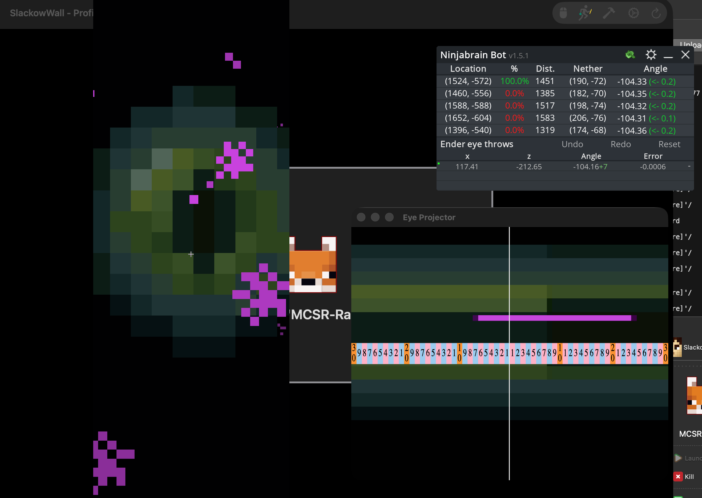

# SlackowWall
Direct Download → [SlackowWall for macOS](https://github.com/Slackow/SlackowWall/releases/latest/)

Or via Homebrew:
```
brew install slackow/apps/slackowwall
```




# What is SlackowWall?
SlackowWall is a multi-instance manager for macOS designed specifically for speedrunners, enabling control over multiple instances simultaneously.

SlackowWall also enables the BoatEye measurement strategy via features like the Eye Projector and Sensitivity Scaling. [BoatEye Setup Guide](https://www.youtube.com/watch?v=RmAmL7JhGJw)

If you want to use the wall on a version that does not have the SeedQueue mod available, you should follow this [guide](Info/guide.md).

# How It Works
When launched, SlackowWall automatically detects and displays all open instances within the main window, with a customizable layout. There are different keybinds to interact with, control, and switch between multiple instances, and a utility mode that allows you to clear worlds and view mods.

SlackowWall also comes with an automatic update system, so once you have it up and running you never have to download anything again!

